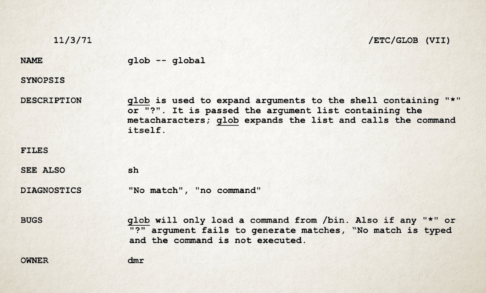

<h1>THE ULTIMATE GUIDE TO <code>.gitignore</code></h1>

_in form of a Q&A_

<!-- TOC start -->

- [TL;DR](#tldr)
- [What is `.gitignore`?](#what-is-gitignore)
   * [Note that `.gitignore` starts with a `.`](#note-that-gitignore-starts-with-a-)
- [Is `.gitignore` mandatory?](#is-gitignore-mandatory)
- [Which files would I want to ignore?](#which-files-would-i-want-to-ignore)
   * [A mini-introduction to globbing](#a-mini-introduction-to-globbing)
      + [Is “glob” an English word?](#is-glob-an-english-word)
      + [And by the way, what does “git” stand for? Is it an acronym?](#and-by-the-way-what-does-git-stand-for-is-it-an-acronym)
- [What's the benefit of excluding certain files?](#whats-the-benefit-of-excluding-certain-files)
- [Should I rely on `.gitignore` for safeguarding sensitive data?](#should-i-rely-on-gitignore-for-safeguarding-sensitive-data)
- [Why do developers usually include executables in the `.gitignore` file?](#why-do-developers-usually-include-executables-in-the-gitignore-file)
- [Does it make sense to take a very conservative approach with `.gitignore`?](#does-it-make-sense-to-take-a-very-conservative-approach-with-gitignore)
- [Where can I find `.gitignore` templates?](#where-can-i-find-gitignore-templates)
   * [Online `.gitignore` generator](#online-gitignore-generator)
- [How to format a `.gitignore` file?](#how-to-format-a-gitignore-file)
   * [Some examples ](#some-examples)
   * [Handling exceptions: understanding unexpected behavior in `.gitignore` negation patterns](#handling-exceptions-understanding-unexpected-behavior-in-gitignore-negation-patterns)
- [How to check which files will be ignored?](#how-to-check-which-files-will-be-ignored)
   * [Example](#example)
   * [A useful command to check all ignored files](#a-useful-command-to-check-all-ignored-files)
- [What happens to tracked files after being added to `.gitignore`?](#what-happens-to-tracked-files-after-being-added-to-gitignore)
   * [A quick reminder: tracked, untracked, and ignored files](#a-quick-reminder-tracked-untracked-and-ignored-files)
   * [How Git handles tracked vs. untracked files](#how-git-handles-tracked-vs-untracked-files)
- [How to stop tracking previously tracked files?](#how-to-stop-tracking-previously-tracked-files)
   * [An epic question on StackOverflow](#an-epic-question-on-stackoverflow)
   * [Example](#example-1)
- [Why would I want to ignore `.gitignore`?](#why-would-i-want-to-ignore-gitignore)
- [Where should I put `.gitignore`?](#where-should-i-put-gitignore)
   * [Order of precedence of `.gitignore` patterns](#order-of-precedence-of-gitignore-patterns)
   * [Which Git commands support passing `.gitignore` patterns via the command line?](#which-git-commands-support-passing-gitignore-patterns-via-the-command-line)
      + [Preventing specific files from being removed by `git clean`](#preventing-specific-files-from-being-removed-by-git-clean)
      + [Using `git ls-files` with exclude patterns](#using-git-ls-files-with-exclude-patterns)
- [What's the difference between `.gitignore` and `~/.gitignore_global`?](#whats-the-difference-between-gitignore-and-gitignore_global)
- [What's the difference between `.gitignore` and `.git/info/exclude`?](#whats-the-difference-between-gitignore-and-gitinfoexclude)
- [What's the order of precedence for all these ignore files?](#whats-the-order-of-precedence-for-all-these-ignore-files)
- [And what is `.gitkeep`?](#and-what-is-gitkeep)
   * [Why does Git ignore empty folders?](#why-does-git-ignore-empty-folders)
   * [Digression: Deep dive into Git's content-oriented storage](#digression-deep-dive-into-gits-content-oriented-storage)
      + [Internal representation of files in Git storage](#internal-representation-of-files-in-git-storage)
      + [Internal representation of directory structure in Git storage](#internal-representation-of-directory-structure-in-git-storage)
      + [Example](#example-2)
- [What gitmoji should I use when adding or updating a `.gitignore` file?](#what-gitmoji-should-i-use-when-adding-or-updating-a-gitignore-file)
- [Did Git first introduce ignore functionality and glob pattern usage?](#did-git-first-introduce-ignore-functionality-and-glob-pattern-usage)
- [What are some other common ignore files in software development?](#what-are-some-other-common-ignore-files-in-software-development)
- [Where to locate examples of ignore files?](#where-to-locate-examples-of-ignore-files)
- [How can I use `.gitignore` as a conversation starter?](#how-can-i-use-gitignore-as-a-conversation-starter)
- [Additional resources and further reading](#additional-resources-and-further-reading)

<!-- TOC end -->

# TL;DR

Create a text file named `.gitignore` in your project's working directory to tell Git which files to ignore. Each line in the file should contain a _glob_ pattern that matches the files you don't want to track in your Git repository.

For instance, the line

    *.tmp
    
tells Git to ignore all files with the extension `.tmp`.

Comment lines in `.gitignore` start with a `#`, empty lines are ignored.

If `.gitignore` contains files that had previously been tracked, remove them with

    git rm --cached
    
Be aware that relying solely on `.gitignore` is not the recommended approach for preventing the accidental exposure of confidential data in your Git repository! 

Use [GitHub templates](https://github.com/github/gitignore), [GitLab](https://gitlab.com/projects/new)'s pre-populated projects, or an [online generator](https://www.toptal.com/developers/gitignore) for inspiration on `.gitignore` file entries. 

# What is `.gitignore`?

`.gitignore` is a text file that contains a list of patterns matching the files Git should ignore, meaning no changes to those files will be recorded in the Git repository.

From the [Git documentation](https://git-scm.com/docs/gitignore):
> gitignore - Specifies intentionally untracked files to ignore

## Note that `.gitignore` starts with a `.`

Note that the `.gitignore` file starts with a dot (`.`). This means you might not be able to see it by default depending on your operating system. For instance, on Linux/Unix/Mac, if you type `ls` you won't see files starting with `.`. In order to see those files too you need to use the option `-a` like this:

    ls -a

Files starting with a `.` are also known as _dotfiles_ and they are usually configuration files. Typical examples of dotfiles are `.bashrc`, the configuration file for interactive bash sessions or the `.ssh` folder containing configuration files and keys for the SSH client.

See also: 

- [What are dot-files?](https://askubuntu.com/questions/94780/what-are-dot-files) on [askubuntu.com](https://askubuntu.com)
- [Awesome dotfiles](https://github.com/webpro/awesome-dotfiles), a curated list of dotfiles resources, and 
- [https://dotfiles.github.io/](https://dotfiles.github.io/), a guide to dotfiles on GitHub.

# Is `.gitignore` mandatory?

This question was raised [on Reddit](https://www.reddit.com/r/git/comments/o1lyko/is_gitignore_mandatory), and the answer is no—it’s not required.

The `.gitignore` file is simply a convenience that helps manage which files you wish Git to ignore.

That said, including a `.gitignore` file in your repository is a best practice that can elevate the professionalism of your project. You can even initialize it with a placeholder comment, and update it later as needed. 

Create the file in the root of your repository:
```
touch .gitignore
```

Edit the file and add the comment:

```
# Placeholder for .gitignore rules
# Add patterns to ignore files and directories
# Example: *.log to ignore all log files
```

Not only will a `.gitignore` file make your repository look more polished, but it will also motivate you to watch out for unnecessary files cluttering your version control.

By the way, both GitHub and GitLab provide the option to create a `.gitignore` file based on language-specific templates when initializing a new project.

# Which files would I want to ignore?

Typically, output files generated from code runs, such as compiled code, logfiles, in general anything that's temporary and can be re-generated.

For example, the line:

    *.log
    
in a `.gitignore` file will tell Git to ignore all files with the extension `.log` (the asterisk `*` is known as a _globbing pattern_).

## A mini-introduction to globbing

Globbing is the operation that expands a wildcard pattern into the list of pathnames matching the pattern.  Matching is defined by:

 - `?` matches any single character.
 - `*` matches any string, including the
       empty string.
       
For instance, the command

    ls myFile?.txt
    
will return a list of all files such as `myFile1.txt`, `myFile2.txt`, `myFile_.txt`, `myFilea.txt`, etc.

and the command 

    ls *.csv

will return all files with the extension `.csv` (e.g. `myFile1.csv`, `myFile2.csv`, `anotherFile.csv`, `.csv`, etc.).

Source: [glob](https://man7.org/linux/man-pages/man7/glob.7.html)

Of course, if you have a logfile in your repository to showcase something about logfiles, then you won't want to ignore that file because of it being an integral part of your code release.

### Is “glob” an English word?

The name “glob” is the abbreviation of “global” and it originates from the 1971 Bell Labs' Unix version. Here is the description of `/etc/glob` from the Unix Programmer's Manual (K. Thompson and D. M. Ritchie, November 3, 1971 [available online](https://www.bell-labs.com/usr/dmr/www/1stEdman.html)):
> `glob` is used to expand arguments to the shell containing `*` or `?`. It is passed the argument list containing the metacharacters; glob expands the list and calls the command itself

Traveling back to the 70s, here's a how the original page looked like ([source](https://www.bell-labs.com/usr/dmr/www/man71.pdf)):



### And by the way, what does “git” stand for? Is it an acronym?


From the [README](https://github.com/git/git/blob/e83c5163316f89bfbde7d9ab23ca2e25604af290/README) file in Git's Git repository:

> “git” can mean anything, depending on your mood

But its author Linus Torvalds also claims to have named Git after “git”, the British slang word for “unpleasant person” (as in: “that mean old git”).

# What's the benefit of excluding certain files?

Excluding certain files from version control using `.gitignore` serves several important purposes:

1. Limiting Storage Footprint: Ignoring unnecessary files helps reduce the size of your repository. This is particularly important for large files, temporary files, or files generated during the build process, which can quickly inflate the size of your repository and consume storage space.

2. Maintaining a Clean Repository: By excluding irrelevant files, you keep your repository clean and focused on the core files essential to your project. This makes it easier to navigate, understand, and collaborate on the codebase without clutter from unrelated files.

3. Improving Performance: Ignoring unnecessary files can improve the performance of Git operations such as cloning, fetching, and pushing. With fewer files to process, these operations can be faster and more efficient, especially for distributed teams or large projects.

4. Facilitating Collaboration: Ignoring editor or IDE-specific files, build artifacts, or dependencies ensures consistency across different development environments. It prevents conflicts and compatibility issues that may arise when collaborators use different tools or configurations.

5. Enhancing Security and Privacy: .gitignore helps prevent sensitive information, such as API keys, passwords, or personal configuration files, from being accidentally committed to the repository. By excluding such files, you reduce the risk of exposing sensitive data to unauthorized users. However, please refer to the following section for caveats.

In summary, excluding files using `.gitignore` promotes efficient repository management, improves performance, enhances security, and fosters collaboration by maintaining a focused and clutter-free codebase.

# Should I rely on `.gitignore` for safeguarding sensitive data?

Adding files containing sensitive information to `.gitignore` is not a good idea and you should better keep those files in a different location than your Git workspace.

`.gitignore` does not provide foolproof protection against unintentional disclosure of confidential data (think of the case that a collaborator deletes the `.gitignore` file). To mitigate the risk of disclosing sensitive information it is crucial to implement additional security measures, such as proper access controls, encryption, and regular audits.

Here are some recommended practices for handling sensitive data in a Git repository:

- **Avoid Hardcoding Secrets:** refrain from hardcoding sensitive information directly into the source code. Use configuration files or environment variables instead. Save a template to your Git repository and the actual secrets locally or in a vault service.
- **Security Audits:** use tools like [`git-secrets`](https://github.com/awslabs/git-secrets) or [gitleaks](https://github.com/gitleaks/gitleaks) to scan your code for passwords and other sensitive information before committing it to a Git repository.
- **Encrypt Sensitive Files:** use [`git-crypt`](https://github.com/AGWA/git-crypt) to protect sensitive files by encrypting them when committed.


# Why do developers usually include executables in the `.gitignore` file?

Adding executables to the `.gitignore` file is a common practice in software development for a few reasons:

- **Build Process Artifacts:** Including executables in version control is redundant, as they can be recreated whenever needed by anyone with the source code and the necessary build tools. Uploading executables to a Git repository defies the essential purpose of version control, which is designed for tracking changes in source code.
- **Platform Independence:** Executables are platform-specific. Including them in version control can cause issues when team members are using different operating systems. By ignoring executables, you avoid potential conflicts.
- **Repository Size and Speed:** executables tend to be large files, leading to slower repository operations.
- **Security:** The presence of executables in a public Git repository can pose security risks and may potentially be exploited in various ways:
  - **Malicious Code Injection:** Executables might be modified to include malicious functionalitys. Users who download and run these modified executables may inadvertently introduce security threats into their systems.
  - **Information Disclosure:** Executables might contain hardcoded credentials or other confidential information. 


# Does it make sense to take a very conservative approach with `.gitignore`?

Does it make sense to take a very conservative approach with `.gitignore` by ignoring everything (*) by default and explicitly specifying the files and directories to include?

I asked this question to ChatGPT since this is the approach I've chosen for the current repository. ChatGPT responded with a clear “yes, it absolutely makes sense” and then [elaborated](https://chatgpt.com/share/677aecf7-a990-8012-8c52-802fbc77f2c4) on the advantages and disadvantages of adopting such an approach.

In my opinion, explicitness is certainly the main advantage, as it makes clear which files are intended to be tracked in version control. are the risk of unintentionally omitting important files and the need for diligent maintenance of the `.gitignore` file to ensure nothing essential is overlooked. Overall, the approach appears to be well-suited for the current repository.

As a side note, you might have noticed that I added a link to the conversation in question. Did you know that you can [share your ChatGPT conversations](https://chatgpt.com/share/6749af1c-0e14-8012-8830-ce0554744fc3)?


# Where can I find `.gitignore` templates?

The [gitignore](https://github.com/github/gitignore) repository on GitHub provides a collection of `.gitignore` templates for many programming languages.

If you've ever worked with LaTeX you will be familiar with the `.log`, `.aux`, etc. files that can reasonably be excluded from your Git repository. Here's how an excerpt from the `Tex` template looks like:

```
## Core latex/pdflatex auxiliary files:
*.aux
*.lof
*.log
*.lot
*.fls
*.out
*.toc

## Intermediate documents:
*.dvi
*.xdv
*-converted-to.*
# these rules might exclude image files for figures etc.
# *.ps
# *.eps
# *.pdf

## Generated if empty string is given at "Please type another file name for output:"
.pdf
```

(the `.pdf` file at the end with no name, just an extension, is the typical file you would want to delete anyway)

**Note:** GitHub will propose to choose from its list of `.gitignore` templates when creating a new project. Gitlab does not have this option for generic projects but it includes a `.gitignore` file in pre-populated template projects.

## Online `.gitignore` generator

There's also an online generator of `.gitignore` files: [gitignore.io](https://www.toptal.com/developers/gitignore). Enter the programming languages used in your repository and the generator will create a `.ignore` file for you.

# How to format a `.gitignore` file?

Here are the formatting rules for `.gitignore`:

1. a line starting with a hash (`#`) is a comment and is ignored, for example:
   
   `# this is a comment line`
   
2. blank lines are ignored, and so they can be used as a separators for readability
3. backslash (`\`) is the [_escape character_](https://tldp.org/LDP/Bash-Beginners-Guide/html/sect_03_03.html), so for instance `\#` at the beginning of a patterns means that the pattern begins with a hash (`\#` undoes the special meaning of the hash character)
4. trailing spaces are ignored unless they are quoted with backslash (`\`)
5. a prefix `!` negates the pattern thus including files that were excluded by a previous pattern. Of course `!` can be escaped with a backslash (`\!`) for matching files that begin with an exclamation point.
6. the slash (`/`) is the directory separator and it has a different meaning depending on its position in the gitignore search pattern:
   - `/` at the end of the pattern means that the pattern only matches directories
   - `/` at the beginning or middle (or both) of the pattern means that the pattern is relative to the directory level of the particular `.gitignore` file itself. Otherwise the pattern may also match at any level below the `.gitignore` level.
6. globbing: 
	- an asterisk `*` matches anything except a slash (`/`)
	- the character `?` matches any one character except `/`
	- the range notation, e.g. `[a-zA-Z]`, can be used to match one of the characters in a range
	- two asterisks (`**`) match any number of subdirectories

## Some examples 

**Note:** `% ` represents my shell prompt.

Let's say you have in your Git repository a file named `myFile1` and a directory `myDir` containig three files: `myFile1`, `myFile2`, `myFile3` :

```
% tree
.
├── myDir
│   ├── myFile1
│   ├── myFile2
│   └── myFile3
└── myFile1

1 directory, 4 files
```

Assume your `.gitignore` file contains the lines:

```
# skip all files like myFile[0-9]
myFile[0-9]
```

Then these files will be skipped:

```
./myFile1
./myDir/myFile1
./myDir/myFile2
./myDir/myFile3
```

But if `.gitignore` file contains the lines:

```
# skip all files like myFile[0-9] but only if in the root folder
/myFile[0-9]
```

then only  `./myFile1` will be skipped.

## Handling exceptions: understanding unexpected behavior in `.gitignore` negation patterns

When using a negation pattern in .gitignore, you might encounter an unexpected result. For example, consider the following `.gitignore` file:

```
myDir      # Ignore the entire myDir folder
!myDir/myFile.txt  # Exception: don't ignore myFile.txt
```

At first glance, you might expect `myFile.txt` to be tracked by Git because you've added an exception. However, this won't work as expected. Once Git ignores a folder, it stops scanning its contents, including any files inside, so `myFile.txt` will still be ignored.

The reason why the negation pattern has no effect on a file if its parent directory is excluded is that:

> _Git doesn’t list excluded directories for performance reasons, so any patterns on contained files have no effect, no matter where they are defined._

(from: [pattern format](https://git-scm.com/docs/gitignore/en#_pattern_format) in the official documentation).

It's still possible to achieve the desired behavior—ignoring all files in the folder except `myFile.txt`—by using a workaround. You can modify your `.gitignore` like this:

```
myDir/*         # Ignore all files in myDir
!myDir/myFile.txt  # Exception: Track myFile.txt
```

This pattern ensures that Git ignores everything in `myDir` but still checks for `myFile.txt` explicitly. With this approach, `myFile.txt` will be tracked while the rest of the folder remains ignored.


# How to check which files will be ignored?

Git provides a handy utility to debug `.gitignore`: `git-check-ignore`.

To check whether a path or file is going to be ignored by `git` use:

    git check-ignore [<options>] <pathname>…​
    git check-ignore [<options>] --stdin

## Example

My `.gitignore` file contains one single line, the kind of pattern I want to ignore are all files like `myFile1`, `myFile2`, ... but only if they are in the root folder.


```
% cat .gitignore
# skip all files like myFile[0-9] but only if in the root folder
/myFile[0-9]
```

With the above `.gitignore` the file `myFile1` in the top directory is skipped:

```
% git check-ignore -v myFile1  
.gitignore:2:/myFile[0-9]	myFile1
```

while `myFile1` in `myDir` is not (no output)

```
% git check-ignore -v myDir/myFile1 
```

To get an output also for non-matching files use the option `-n` in combination with `-v`:

```
git check-ignore -v -n myDir/myFile1
::	myDir/myFile1
```

In this case, the file `myDir/myFile1` is shown in the output of `git check-ignore` but the file won't be ignored by `git` as it does not match any pattern in `.gitignore`.

## A useful command to check all ignored files

Check all files in the Git working directory:

    % find . -not -path './.git/*' | git check-ignore --stdin -v
    
This command will scan all files and folders in your current directory and check whether they're going to be ignored according to the directives in `.gitignore`. For files that are going to get ignored the `.gitignore` rule is also indicated (line number in `.gitignore`) when using the option `-v`.

Credit for the `find` command: [this answer on Stackoverflow](https://stackoverflow.com/a/467053) (“_Git command to show which specific files are ignored by .gitignore_”).

 
# What happens to tracked files after being added to `.gitignore`?

The `.gitignore` file is designed to prevent untracked files from being added to the repository and it does not affect files that are already tracked.

This means that adding files that are already tracked to `.gitignore` can lead to confusion, as `.gitignore` does not retroactively affect files that are already being tracked. Git will continue to monitor those files, even if they match a pattern in `.gitignore`.

## A quick reminder: tracked, untracked, and ignored files


In Git files fall in one of the two categories:

**1. Tracked files**
These are files that Git is currently monitoring for changes. They have been added to Git's staging area at some point (using `git add`) and committed to the repository.

**2. Untracked Files**
Files that exist in the working directory but are not yet added to Git's tracking system. These files are not part of the repository, and Git does not monitor their changes. They can be added to the repository with `git add`, moving them into the "tracked" category.

Ignored files are files that are also untracked but have been explicitly excluded from version control by adding them to `.gitignore` or other exclusion rules. Git ignores these files, meaning it neither tracks nor reports them as untracked in `git status`. They are treated as if they don't exist in the repository from Git’s perspective.


## How Git handles tracked vs. untracked files

Here's a breakdown of Git's behavior depending on whether the file is already tracked or untracked:

**1. If the file is untracked:**

- Expected behavior:

 	* Git will ignore the file, as specified in `.gitignore`.
	* The file will not appear in the output of `git status`, and Git will not allow you to accidentally add it to the repository.

- Example:

```
echo "temp.log" > .gitignore
echo "temporary data" > temp.log
git status
# Output: "Nothing to commit, working tree clean" (temp.log is ignored)

git add temp.log
# Output: "The following paths are ignored by one of your .gitignore files"
```	

**2. If the file is already tracked:**

- Behavior:

 	* Git will continue to track the file, regardless of its inclusion in `.gitignore`.
   * Changes to the file will still be staged and committed, and the file will appear in `git status`.
   
- Example:

```
echo "temp.log" > .gitignore
echo "important data" > temp.log
git add temp.log
git commit -m "Add temp.log"

# Now add temp.log to .gitignore
echo "temp.log" >> .gitignore

# Modify the file
echo "new data" >> temp.log
git status
# Output: "Changes not staged for commit: temp.log"
```

Due to this behavior, if you want to ignore a tracked file you first need to _untrack_ it.


# How to stop tracking previously tracked files?

To tell Git to stop tracking a file (aka ignoring it) you can use `git rm --cached`. 

See also [“How do I make Git forget about a file that was tracked, but is now in .gitignore?”](https://stackoverflow.com/questions/1274057/how-do-i-make-git-forget-about-a-file-that-was-tracked-but-is-now-in-gitignore).

⚠️ The [top-scoring answer](https://stackoverflow.com/a/1274447) has been recently updated:

> _Do NOT use `git rm --cached <file>` if you ever want to see that file again. It will remove it from git, and also your local machine._

I'll update the guide on this issue as soon as I determine the best practice.

## An epic question on StackOverflow 

The question [“How do I make Git forget about a file that was tracked, but is now in .gitignore?”](https://stackoverflow.com/questions/1274057/how-do-i-make-git-forget-about-a-file-that-was-tracked-but-is-now-in-gitignore) ranks $8$ in the list of the top $10$ questions on StackOverflow tagged `git` (source: [data.stackexchange.com](https://data.stackexchange.com/stackoverflow/query/524537/11-great-questions-by-score-for-given-tagname-idug-presentation)) and with a score of $8241$, $2.4$ Million views and $46$ answers, it can be indeed considered epic!

Post Link|Score|tags|creationdate
---|---|---|---|
[How do I undo the most recent local commits in Git?](https://stackoverflow.com/q/927358)|26326|`git` `version-control` `git-commit` `undo`|2009-05-29 18:09:14
[How do I delete a Git branch locally and remotely?](https://stackoverflow.com/q/2003505)|20387|`git` `version-control` `git-branch` `git-push` `git-remote`|2010-01-05 01:12:15
[What is the difference between 'git pull' and 'git fetch'?](https://stackoverflow.com/q/292357)|13816|`git` `version-control` `git-pull` `git-fetch`|2008-11-15 09:51:09
[How can I rename a local Git branch?](https://stackoverflow.com/q/6591213)|11594|`git` `version-control` `git-branch`|2011-07-06 03:20:36
[How do I undo 'git add' before commit?](https://stackoverflow.com/q/348170)|11331|`git` `undo` `git-add`|2008-12-07 21:57:46
[How do I force "git pull" to overwrite local files?](https://stackoverflow.com/q/1125968)|9635|`git` `version-control` `overwrite` `git-pull` `git-fetch`|2009-07-14 14:58:15
[How do I check out a remote Git branch?](https://stackoverflow.com/q/1783405)|8631|`git` `git-checkout` `remote-branch`|2009-11-23 14:23:46
**[How do I make Git forget about a file that was tracked, but is now in .gitignore?](https://stackoverflow.com/q/1274057)**|**8241**|**`git`** **`gitignore`** **`git-rm`**|**2009-08-13 19:23:22**
[How do I remove local (untracked) files from the current Git working tree?](https://stackoverflow.com/q/61212)|8123|`git` `branch` `git-branch`|2008-09-14 09:06:10
[How to modify existing, unpushed commit messages? ](https://stackoverflow.com/q/179123)|7648|`git` `git-commit` `git-rewrite-history` `git-amend`|2008-10-07 15:44:47

## Example

**Note:** `gitignore_tests % ` represents my shell prompt.

Remove all files in the directory `gitignore_tests`

    gitignore_tests % rm -rf .git 
    gitignore_tests % rm -rf .gitignore 
    
Initialize an empty `git` repository

    gitignore_tests % git init
 Initialized empty Git repository in /Users/myUsername/Documents/gitignore_tests/.git/
 
 Create two files in the working directory `gitignore_tests` and commit them to the repository
 
    gitignore_tests % touch myFile1 myFile2
    gitignore_tests % git add .
    gitignore_tests % git status
    On branch master

    No commits yet

    Changes to be committed:
      (use "git rm --cached <file>..." to unstage)
	    new file:   myFile1
	    new file:   myFile2

    gitignore_tests % git commit -m "add myFile1 myFile2"   
    [master (root-commit) a5bc16b] add myFile1 myFile2
     2 files changed, 6 insertions(+)
     create mode 100644 myFile1
     create mode 100644 myFile2

Now create a `.gitignore` file 

    gitignore_tests % cat << EOF > .gitignore                
    # skip all myFile0, myFile1
    myFile[0-1]
    EOF

**Note:** I used [this solution](https://stackoverflow.com/a/43423683) to add text to a file on the command line with [_here documents_](https://tldp.org/LDP/abs/html/here-docs.html).

Add the `.gitignore` file to the repository

    gitignore_tests % git add .
    gitignore_tests % git commit -m "add .gitignore" 
    [master 13ce4cf] add .gitignore
     1 file changed, 2 insertions(+)
     create mode 100644 .gitignore
     
You can see that `myFile1` is still being tracked by running `ls-files`:

    gitignore_tests % git ls-files
    .gitignore
    myFile1
    myFile2
    
If you change and commit `myFile1`, the changes will be tracked by `git`.

    gitignore_tests % cat << EOF >> myFile1                 
    some text
    EOF
    gitignore_tests % git add .
    gitignore_tests % git commit -m "modify myFile1"
    [master 9e8c612] modify myFile1
     1 file changed, 1 insertion(+)
     
To remove `myFile1` from the `git` index use `git rm --cached`

    gitignore_tests % git rm --cached myFile1
    rm 'myFile1'

Now `myFile1` does not appear in `ls-files`

    gitignore_tests % git ls-files                          
    .gitignore
    myFile2

and it is not tracked by `git` anymore

    gitignore_tests % git commit -m "untrack myFile1"
    [master 7f978a2] untrack myFile1
     1 file changed, 7 deletions(-)
     delete mode 100644 myFile1
    gitignore_tests % cat << EOF >> myFile1               
    some other text
    EOF
    gitignore_tests % git add .                      
    gitignore_tests % git commit -m "modify myFile1 again"
    On branch master
    nothing to commit, working tree clean
    gitignore_tests % 


# Where should I put `.gitignore`?

`.gitignore` is usually located in Git project's working directory (this is the directory containing the `.git` folder, the actual Git repository). 

However a `.gitignore` file can also be located in any subfolder of the top-level of the working tree. Files to be ignored can also be specified as options from the command line. Patterns from different `.gitignore` files are taken into account by `git` following some rules of precedence.


`.gitignore` files that are not in the root directory of your Git project have an “ignore” effect on the folders in which they're located and on their subfolders.

## Order of precedence of `.gitignore` patterns 

From the [`.gitignore` documentation](https://git-scm.com/docs/gitignore):

> Each line in a gitignore file specifies a pattern. When deciding whether to ignore a path, Git normally checks gitignore patterns from multiple sources, with the following order of precedence, from highest to lowest (within one level of precedence, the last matching pattern decides the outcome):
> 
> - Patterns read from the command line for those commands that support them (see [Which Git commands support passing `.gitignore` patterns  via the command line?](#which-git-commands-support-passing-gitignore-patterns-via-the-command-line)).
> 
> - Patterns read from a `.gitignore` file in the same directory as the path, or in any parent directory (up to the top-level of the working tree), with patterns in the higher level files being overridden by those in lower level files down to the directory containing the file. These patterns match relative to the location of the `.gitignore` file. A project normally includes such `.gitignore` files in its repository, containing patterns for files generated as part of the project build.
> 
> - Patterns read from `$GIT_DIR/info/exclude`.
> 
> - Patterns read from the file specified by the configuration variable `core.excludesFile`.


## Which Git commands support passing `.gitignore` patterns via the command line?

Among the commands that support gitignore patterns are `git clean` with the `-e` option and `git ls-files` with the `--exclude` option.

### Preventing specific files from being removed by `git clean`

While `.gitignore` helps keep your Git repository organized by excluding unnecessary files, there are times when you need to declutter your working directory itself — and that’s where `git clean` comes in handy.

The [`git clean`](https://git-scm.com/docs/git-clean) command does exactly what its name suggests: it "cleans up" your working directory by removing files you don't care about—often referred to as "unmanaged" or "non-essential" files. These include files that are either untracked, ignored, or both, depending on the options you specify when running `git clean`. The command operates recursively from the current directory (which can be a subdirectory of subdirectory of your working directory), and respects the exclude rules specified in `.gitignore`.

⚠️ **Caution:** the `git clean` command should _always be used with caution_, as it can permanently delete untracked files or directories from your working directory! 

Think of it as tidying up a cluttered desk: you sweep away scraps of paper and junk (untracked or ignored files) but must be careful not to toss out anything important (valuable files you want to keep). The option [`-n`](https://git-scm.com/docs/git-clean#Documentation/git-clean.txt--n) (or equivalently [`--dry-run`](https://git-scm.com/docs/git-clean#Documentation/git-clean.txt--n)) enables the safe use of `git clean` by displaying which files would be deleted without actually removing them.  This is like sorting through the pile first to ensure nothing crucial gets thrown away.

Next, let's look at an example of using the `-e <pattern>` option (equivalent to `--exclude=<pattern>`) with `git clean`. The `-e` option allows you to specify patterns to exclude certain files from being cleaned, in addition to those already ignored by the `.gitignore` rules.

**Example:**

```
git clean -dx --dry-run -e "*.log" 
```

Assume your repository has this structure

```
project
├── .gitignore
├── file1.tmp
└── src
    ├── file2.tmp
    └── debug.log
```
and that the `.gitignore` file contains:
```
*.tmp
*.log
```
If you navigate to `project` and run:

```
git clean -dX --dry-run 
```
you will see:
```
Would remove file1.tmp
Would remove src/debug.log
Would remove src/file2.tmp
```
Note that if we hadn't used the `-d` option we would not have cleaned up the `src` directory, that is untracked since it contains only ignored files.

With the option `-e` we can exclude certain files using `.gitignore` patterns. For instance, if we want to keep `*.log` files we can use:
```
git clean -dX -e \!*.log
```
Now the output is:
```
Would remove file1.tmp
Would remove src/file2.tmp
```
The file `debug.log` is in this case spared from the cleaning because the pattern passed to the `-e` option overrides the `.gitignore` directives.

Notice how you need to use "exclude" patterns wit the option `-e`, which might be counterintuitive to some. Thanks to [this answer](https://stackoverflow.com/a/17156948) on Stack Overflow (“Git: Exclude a file with git clean”).

### Using `git ls-files` with exclude patterns

With the working directory of the previous section, we can use [`git ls-files`](https://git-scm.com/docs/git-ls-files) to view information on files in the working tree, here for instance we are listing all files (they're untracked):
```
$ git ls-files --others
file1.tmp
src/debug.log
src/file2.tmp
```

With the `--exclude` option we can omit certain files from the listing.
```
$ git ls-files --others --exclude="*.log"
file1.tmp
src/file2.tmp
```

# What's the difference between `.gitignore` and `~/.gitignore_global`?

Another important ignore file is the `~/.gitignore_global`. This file resides on your local machine and is specific to your user account; it is not shared with others and is not tracked by Git.

In this file, you can define ignore rules using the same format as in `.gitignore`. These rules apply universally across all projects you work on, allowing you to keep your development environment organized by ignoring files that are specific to your setup or tooling.


# What's the difference between `.gitignore` 	and `.git/info/exclude`?

The `exclude` file—located in the `.git` folder under `info`—is similar to `.gitignore`, but it is used for local ignore rules that are specific to a particular repository on a developer's machine.

The `.git` directory is a special hidden folder that is not tracked by Git and it contains all the metadata and configuration files Git needs to manage the repository. This means that the file `.git/info/exclude`:

  - is only visible to the developer on the local machine
  - is not tracked by Git
  
Git reads the local `.git/info/exclude` file whenever you run commands like `git status`, `git add`, or `git commit` to determine which files should be ignored and not included in the list of "untracked files."
A file listed only in `.git/info/exclude`, but not in `.gitignore`, will just be ignored when you run Git commands, but others won’t see that rule because `.git/info/exclude` is only for your local setup.


# What's the order of precedence for all these ignore files?

Here is the priority list that Git follows to determine which set of ignore rules to apply when there are multiple places where files can be ignored, from most to least important:

1. `.gitignore`
2. `~/.gitignore_global`
3. `.git/info/exclude`
 
# Why would I want to ignore `.gitignore`?

Oftentimes one finds the line 

    .gitignore

in `.gitignore` files. 

Even though this is allowed, it is not considered good practice because it can lead to inconsistencies in what files are ignored for different users or environments, as collaborators won’t receive updates to these rules.

There are some situations when ignoring `.gitignore` is justified:

- personal development environments: A developer might ignore their `.gitignore` if they have custom rules (defined in `.git/info/exclude` or `~/.gitignore_global`) that are specific to their local setup and don't want to share them with the team. 
- temporary solutions: for instance, a developer is working on a web application that requires various local configuration files, such as `.env` files, which contain sensitive data. To ensure that the `local.env` file is never accidentally committed to the repository, the developer adds the lines

 ```
 # .gitignore (temporary modification)
 .gitignore
 local.env
 ```
 to make sure that `.gitignore` is not changed anymore (which might lead to `local.env` getting tracked).


# And what is `.gitkeep`?

`.gitkeep` is a dummy file used in empty directories to trick Git into tracking them. Git would otherwise not add empty directories.

While `.gitkeep` is a common choice, any other file name can be used to keep empty directories tracked. Some prefer to use the file `.keep` or even an empty `.gitignore` (or containing the line `!.gitignore` to prevent it from being ignored in case already untracked).

See also: [What are the differences between .gitignore and .gitkeep?](https://stackoverflow.com/questions/7229885/what-are-the-differences-between-gitignore-and-gitkeep) and [How do I add an empty directory to a Git repository?](https://stackoverflow.com/questions/115983/how-do-i-add-an-empty-directory-to-a-git-repository/932982).


## Why does Git ignore empty folders?

Git tracks content rather than the directory structure itself, meaning that it tracks and identifies files based on their content, not their file names or locations. The directory structure is recorded separately, but empty folders are ignored because they contain no content to track.

This approach makes sense not only from a performance perspective—since empty folders could add unnecessary overhead—but also conceptually, as Git is designed to track meaningful content changes. An empty folder doesn’t represent a significant change in version control, so it’s excluded.

## Digression: Deep dive into Git's content-oriented storage

To clarify further, Git's storage system consists of two components: a _content-addressable mechanism_ for storing file data and a structure that tracks the directory hierarchy.

### Internal representation of files in Git storage

Before being stored, files are hashed by computing a cryptographic hash (SHA-1) of the file's content. This hash is a unique 40-character string that acts as an identifier for the file in Git’s internal repository. Even if the file is renamed or moved, as long as the content remains the same, its hash will stay the same. This system makes Git very efficient when handling identical content across different versions of files, even if the file names change or the file is moved in the directory structure. 

A file is saved as _blob object_ (raw content of the file without any metadata like file name or location) and, since files are indexed by their hashes, if two files have the same content, Git only stores one blob and references it in multiple places.

### Internal representation of directory structure in Git storage

Git does track the directory structure of files, but it does so in a separate step from the content. While file content is stored as _blob object_, the file names and directory hierarchy are stored using _tree objects_. 

A tree object represents a directory. It contains references (pointers) to other objects in the repository, such as:

  - blobs (which represent file content)
  - other tree objects (which represent subdirectories)

A thorough description of Git's internal data representation and storage mechanisms can be found in ['Git from the Bottom Up'](http://ftp.newartisans.com/pub/git.from.bottom.up.pdf).

### Example

Let’s say you have a project with this structure:

```
project/
├── docs/         (empty folder)
├── src/
│   └── main.c
├── README.md
└── hello_file
```

 - The `README.md` file’s content is stored in a blob object with a SHA-1 hash, for example, `aaf4c61ddcc5e8a2dabede0f3b482cd9aea9434d`.
 - If the content of `hello_file` is different from that of `README.md`, it is stored in a separate blob object with its own unique SHA-1 hash. If `hello_file` has the same content as `README.md`, Git will reference the existing blob object instead of creating a new one.  
 - The `src/` directory is represented as a tree object, which references the blob for `main.c`.
 - The root `project/` directory is another tree object, which references the blob(s) for `README.md` and `hello_file`, as well as the tree for `src/`.
 - The `docs/` folder is ignored by Git because it is empty.

To track the `docs/` folder, you would typically add a placeholder file like `.gitkeep`:

```
project/
├── docs/
│   └── .gitkeep  (placeholder file to track empty folder)
├── src/
│   └── main.c
├── README.md
└── hello_file
```

By adding `.gitkeep`, Git now recognizes and tracks the `docs/` directory.

# What gitmoji should I use when adding or updating a `.gitignore` file?

The use of emojis in software development and documentation has emerged as a playful yet effective way to enhance communication and clarity. In the Git world, emojis are referred to as _gitmojis_, and there is an initiative ([https://gitmoji.dev/](https://gitmoji.dev/)) aimed at standardizing their use to represent various types of commits.

Based on the Gitmoji convention, the correct emoji for committing changes to a `.gitignore` file is: 🙈 (:see_no_evil:). A commit message would look like:

    🙈 Add .gitignore
 
# Did Git first introduce ignore functionality and glob pattern usage?

No, Git's `.gitignore` files were not the first to introduce ignore functionality and glob patterns. These features already existed in other version control systems before Git. For example:

- Mercurial, another popular distributed version control system, introduced the `.hgignore` file for specifying patterns to ignore files and directories. Mercurial's ignore file serves a similar purpose to Git's `.gitignore` and also uses glob patterns.

- Subversion (SVN), a centralized version control system, has the `svn:ignore` property that allows users to specify patterns to ignore files and directories within the repository.

Git's implementation of the `.gitignore` file has become widely known and adopted due to Git's popularity and widespread use in software development.

# What are some other common ignore files in software development?

Ignore files play a crucial role in managing a project's source code or other assets by keeping repositories clean and focused on relevant files.

Here's a list of of common ignore files used in different contexts other than Git:

- `.hgignore`: Used in Mercurial repositories for specifying patterns to ignore files and directories.
- `.npmignore`: Used in Node.js projects to specify files and directories that should be ignored when publishing packages to the npm registry.
- `.dockerignore`: Used in Docker projects to specify files and directories that should be excluded from the Docker build context when creating Docker images.
- `.eslintignore`: Used in projects using ESLint to specify files and directories that should be ignored during linting.
- `.prettierignore`: Used in projects using Prettier to specify files and directories that should not be formatted by Prettier.
- `.babelignore`: Used in projects using Babel to specify files and directories that should not be transpiled by Babel ("transpiling" means converting modern JavaScript code into older versions that are compatible with a wider range of browsers or environments).
- `.rsyncignore`: Used with the rsync utility to specify files and directories that should be excluded from synchronization.
 
 
# Where to locate examples of ignore files?

You can use [GitHub's advanced search](https://github.com/search/advanced) to discover a variety of ignore files for inspiration. 

You can search by path


or there's even a programming language called “Ignore List”


As an aside, I'd like to mention that I find GitHub's search feature ([https://github.com/search](https://github.com/search)) very helpful for discovering interesting repositories or code snippets.

# How can I use `.gitignore` as a conversation starter?

Keep in mind that using `.gitignore` as a conversation starter isn’t suitable for every occasion—it works best when you’re around IT professionals or tech-savvy individuals. That said, it can be a lighthearted and practical way to spark a discussion, especially if the person is familiar with Git or programming. Here are a few ideas:

-  Casual and Friendly:
	- **“Hey, quick question—what's the weirdest thing you've ever added to a `.gitignore` file?”**  
  (This can lead to fun stories or insights about their work.)

	- **“I was just updating my `.gitignore` file and started wondering: how do you usually organize yours? Any tips?”**  
  (This opens the door to sharing best practices.)

- Humor:
	- **“Do you think it’s weird to put `*.pdf` in my `.gitignore` file, or should I just embrace the chaos?”**  
  (A lighthearted way to bring up the topic while joking about version control dilemmas.)

	- **“I wish I could create a `.gitignore` for life—what would you put in yours?”**  
  (This blends humor with a thoughtful twist.)

- Relatable Problem-Solving:
	- **“Hey, I’m running into an issue with my `.gitignore` file. It’s not ignoring what I want—got a moment to troubleshoot?”**  
  (This could naturally transition into a more technical discussion.)

	- **“Do you ever struggle to remember all the patterns to add to `.gitignore`, or is that just me?”**  
  (This invites them to share their experiences or strategies.)

Choose an approach based on how formal or casual you want the interaction to be!

# Additional resources and further reading

- [Ignoring files](https://docs.github.com/en/get-started/getting-started-with-git/ignoring-files) A quick start guide on how to configure Git to ignore files you don't want to check in to GitHub.
- [gitignore](https://git-scm.com/docs/gitignore) by the Git community
- Pro Git book, by Scott Chacon and Ben Straub available [online](https://git-scm.com/book/en/v2). A thorough and accessible guide to Git, covering everything from the basics to advanced usage.
- [Ignore files that have already been committed to a Git repository](https://stackoverflow.com/questions/1139762/ignore-files-that-have-already-been-committed-to-a-git-repository/1139797#1139797)
- [How do I make Git forget about a file that was tracked, but is now in .gitignore?](https://stackoverflow.com/questions/1274057/how-do-i-make-git-forget-about-a-file-that-was-tracked-but-is-now-in-gitignore)
- 👉[.gitignore](https://www.atlassian.com/git/tutorials/saving-changes/gitignore) A clearly presented, well-structured, and easily comprehensible tutorial on `gitignore` by Atlassian.
- 👉[Git from the bottom up](http://ftp.newartisans.com/pub/git.from.bottom.up.pdf) A comprehensive guide that delves into the inner workings and architecture of Git, explaining how Git operates at a fundamental level and how its core principles influence its behavior. Written in a fun, clear, and concise language, this book transforms the subject of Git into an engaging and entertaining exploration.
- [Multiple .gitignore in subfolders](https://stackoverflow.com/questions/53208235/multiple-gitignore-in-subfolders)
- [Don't ignore .gitignore](https://opensource.com/article/20/8/dont-ignore-gitignore)
- [Learning All about GitIgnore : Ignoring Files and Folders](https://medium.com/@it.hhkn/learning-all-about-gitignore-ignoring-files-and-folders-d731998a7790)
- [Git command to show which specific files are ignored by .gitignore](https://stackoverflow.com/questions/466764/git-command-to-show-which-specific-files-are-ignored-by-gitignore)
- [git-check-ignore](https://git-scm.com/docs/git-check-ignore) Documentation on the `git-check-ignore` tool for debugging `.gitignore`.
